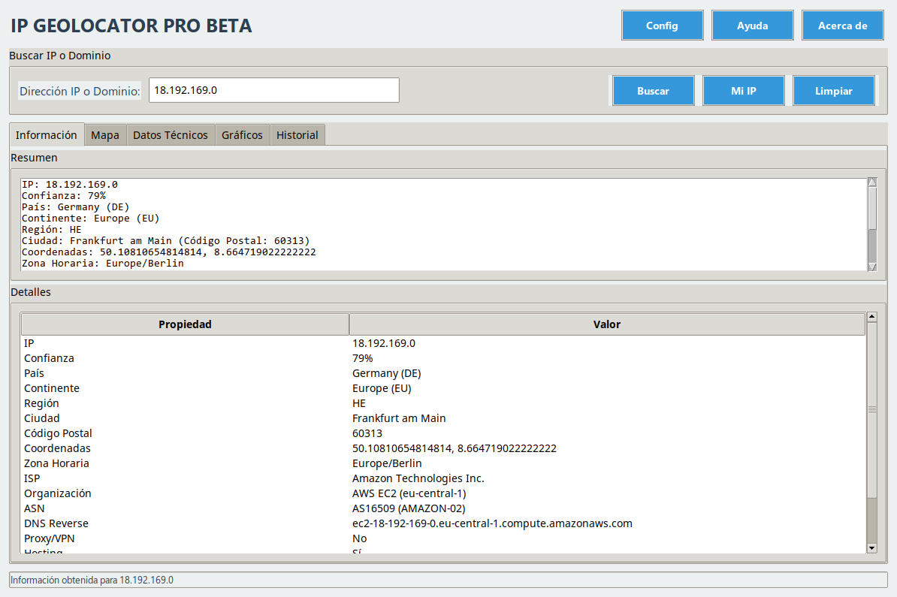

# 🌍 IP GeoLocator Pro BETA

Herramienta avanzada de geolocalización de IP que combina múltiples servicios para máxima precisión.

## ✨ Características

- 🔍 **Geolocalización precisa** combinando 4 servicios (ip-api.com, ipapi.co, etc.)
- 🗺️ **Mapa interactivo** con marcador y círculo de precisión
- 📊 **Gráficos estadísticos** de los resultados
- ⏱️ **Historial completo** con búsqueda y exportación a JSON
- 📋 **Datos técnicos** en formato JSON
- ⚡ **Cache de resultados** para mejor performance
- ⚙️ **Configurable**: zoom, estilo de mapa, servicios activos

## 🛠️ Requisitos

- Python 3.8+
- Dependencias (instalación automática):
- instalacion.
  
pip install -r requirements.txt
